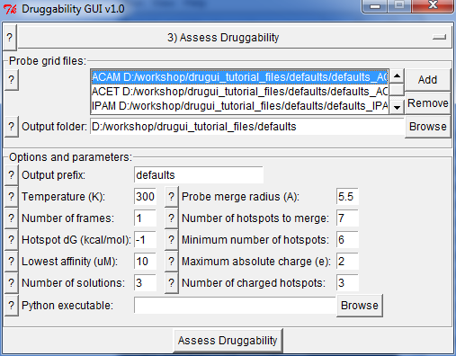

.. _analyze:

Druggability Analysis
=====================

Druggability index based on probe occupancy grids can be calculated using the
following interface:

Input Files
-----------

Input files are probe occupancy grids calculated in the previous step,
e.g. :file:`prefix_IPRO.dx`, :file:`prefix_ICAM.dx`, etc.

Options & Parameters
--------------------

1. This step involves selecting high affinity probe binding spots,
   clustering them, and then merging to assess druggability. Depending on
   parameter choice you may see different number of binding sites
   and some variation in their druggability. This will usually effect
   weakly druggable site. Ideal parameters that worked best for
   a set of diverse proteins are set as defaults and their detailed
   discussions can be found in [AB12]_.

2. GUI will try to locate Python executable path, but if you do not see an
   entry, you will need to specify it manually. Results will be visualized
   immediately, in high resolution if selected so.

Output Files
------------

Output from this step is a set of PDB files written into :file:`prefix`
folder and a :file:`.dso` file that contains Python objects containing
probe grids.

