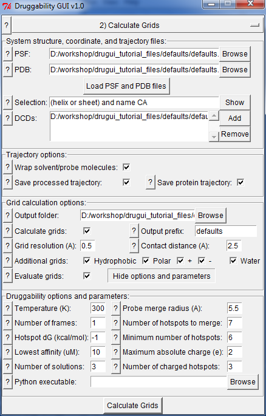

.. _grids:

Probe Grid Calculation
======================

When simulations are complete, you need to perform grid calculations using
the following interface:

Input Files
-----------

Input files are :file:`prefix.psf` and :file:`prefix.pdb` files,
and simulation trajectory files, e.g. :file:`prefix_sim/sim.dcd`.
If you performed multiple simulations for the same system, you can
include all productive simulation trajectories in grid calculations.
Ideally, trajectories from equilibration simulations should not be
included in grid calculations. :guilabel:`Selection` specifies atoms
used to align the target conformations in trajectory frames.

.. note:: Selection is an important input for grid calculations.
   If the binding site move internally when all atoms of the protein
   are used for alignment, you may want to restrict the alignment to
   binding site residues excluding those that are mobile. This will
   help capturing probe enrichment at a binding site properly.
   If there are multiple binding sites that move internally in a protein,
   it would be better to analyze those sites one by one.

Options & Parameters
--------------------

1. For probe enrichment (or occupancy) grid calculations, probe and solvent
   molecules needs to be wrapped. If you like and have enough disk space,
   you may write trajectory frames after they are wrapped. This may be
   good for later visualization and movie making purposes.

2. By default, grids will be calculated for different probe types using their
   central carbon atoms. These grids will be merged in druggability analysis.
   Default grid resolution 0.5 Å has been found to capture probe locations
   ideally.

   For visualization purposes, you may select to output occupancy grids for
   hydrophobic, polar, charged, and water atoms.

   Grids can be visualized using `Chimera Volume Viewer`_ or `VMD`_.

3. You may also select to evaluate grids immediately after their calculation.
   Details of this step is discussed in the next part.

Output Files
------------

Output files are occupancy grids for each probe type, e.g.
:file:`prefix_IPRO.dx`, and selected atom types.

.. _Chimera Volume Viewer: http://www.cgl.ucsf.edu/chimera/docs/ContributedSoftware/volumeviewer/framevolumeviewer.html
