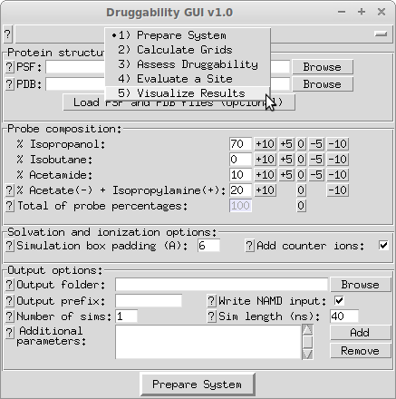

Introduction
============

Druggability Suite is a `VMD`_ plugin GUI and a Python module developed
for setup and analysis of simulations described in [AB12]_.

Installation
------------

1. VMD_ 1.9.1 or later is required for using GUI. NAMD_ is required for
   running druggability simulations. Following are required for performing
   druggability analysis calculations:

  * Python_ 2.7
  * NumPy_ 1.3 or later

2. Download one of the following archive files:

  * `drugui_plugin.tgz`_
  * `drugui_plugin.zip`_

3. Extract contents of the archive and copy :file:`drugui` folder to
   VMD TCL plugins directory, i.e. :file:`$VMDDIR/plugins/noarch/tcl/`.

   Then, insert following line into :file:`$VMDDIR/scripts/vmd/loadplugins.tcl`
   at line 186::

     vmd_install_extension drugui drugui_tk "Modeling/DruGUI"

   If you are not sure where VMD directory is located, run :program:`vmd`, and
   type the following command line in the VMD console::

     global env; puts $env(VMDDIR)

DruGUI Plugin
-------------

Druggability Suite GUI (DruGUI) plugin, shown below, has five panels to
streamline setup, analysis, and visualization of druggability simulations:

  * :ref:`setup`
  * :ref:`grids`
  * :ref:`analyze`
  * :ref:`specify`
  * :ref:`visuals`

The rest of the tutorial will show you how to use these panels, and described
required inputs and outputs from different analysis steps.

Tutorial Files
--------------

Files in the following archives can be used to follow this tutorial:

  * `DruGUI Tutorial Files (TGZ) <drugui_tutorial_files.tgz>`_
  * `DruGUI Tutorial Files (ZIP) <drugui_tutorial_files.zip>`_

Here is a list of these files:

.. literalinclude:: files.txt

How to Cite
--------------
If you benefited from Druggability Suite in your research, please cite the
following paper:

.. [AB12] Bakan A, Nevins N, Lakdawala AS, Bahar I `Druggability Assessment of
   Allosteric Proteins by Dynamics Simulations in the Presence of Probe
   Molecules <http://pubs.acs.org/doi/abs/10.1021/ct300117j>`_
   *J Chem Theory Comput* **2012** 8(7):2435-2447