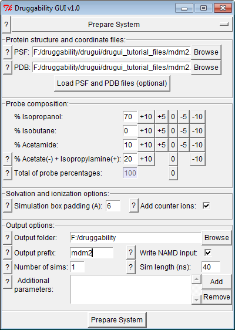
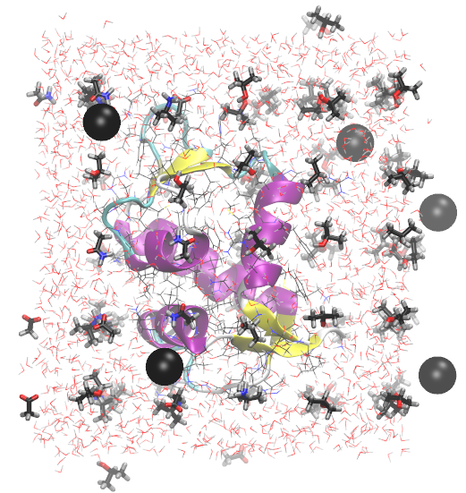

.. _setup:

Simulation Setup
================

System that contains target, probes, water, and counter ions
for druggability simulations can be prepared using the following
interface:

Input Files
-----------

:file:`.psf` and :file:`.pdb` files for the target protein are required
from the user. You can learn how to prepare these files from
`NAMD tutorials`_.

Options & Parameters
--------------------

1. First, select :file:`.psf` (structure) and :file:`.pdb` (coordinate) files.
   You can use the MDM2 files provided for this tutorial. Alternatively,
   structure and coordinate files for a protein of interest can also be used.
   These files should contain all atoms required for protein stability and
   function, these may include cofactors and metal atoms.
   Crystallographic water molecules may also be retained in the

2. Select a probe composition that will complement the surface properties
   of the target protein. Note that, probe percentages must sum up to 100.
   Acetate and isopropylamine percentages will be equal to each other
   so that opposite probe charges are balanced.

   .. note:: It is possible to set all probe percentages to zero. The final
      system will not contain any probes. This may be used as a control
      simulation, to see how the target protein behaves in the absence of
      probes.

3. Enter simulation box padding (distance from the protein to box surfaces)
   and select whether you would like to add counter ions.
   Druggability GUI uses `Solvate`_ and `Autoionize`_ plugins to add
   water, probes, and ions.

4. Select output folder, file prefix, and number of simulations that you
   want to perform. Performing multiple simulations to see whether results
   are reproducible is always a good idea.

Output Files
------------

Output will be :file:`prefix.psf` and :file:`prefix.pdb` files of the system
that contain target protein, water, ions, and probe molecules (if selected).
You system should look like the following:

In addition, you will see :file:`prefix_min`, :file:`prefix_sim`,
:file:`parameters` folders that contain input for molecular dynamics
simulations.

For a summary of contents of the final system, see :file:`prefix.log` file.

Simulation
----------

Now you need to run druggability simulations. See :file:`prefix.sh` file for
NAMD commands that you need to execute. When simulations are complete,
you can continue with following analysis steps.

.. _NAMD tutorials: http://www.ks.uiuc.edu/Training/Tutorials/
.. _Autoionize: http://www.ks.uiuc.edu/Research/vmd/plugins/autoionize/
.. _Solvate: http://www.ks.uiuc.edu/Research/vmd/plugins/solvate/