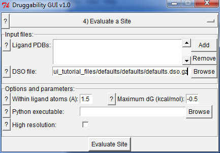
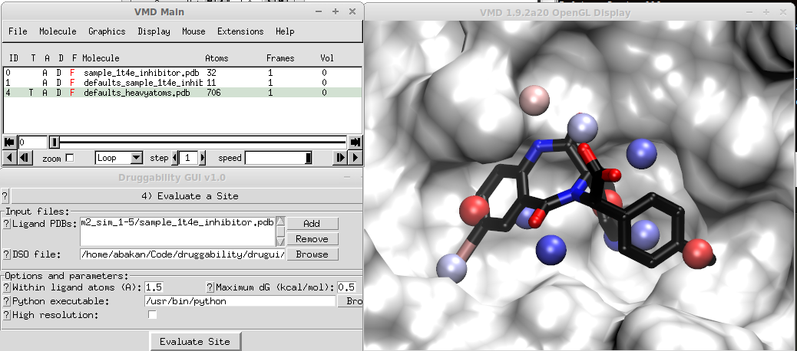

.. _specify:

Analyze a Specific Site
=======================

This interface can be used to select probe binding hotspots that overlap
with a given ligand.

Input Files
-----------

Input files area list of ligand :file:`.pdb` files and :file:`.dso` file
from previous step. Ligand-bound form of the protein should be aligned
to the simulated structure. You can use :file:`prefix_heavyatoms.pdb`
file for alignment.

Options & Parameters
--------------------

1. Parameters determined how many probe binding spots are incorporated in
   assessment of the specified site. Selected probe should be close to
   the ligand, so 1.5 Å should be sufficient. If the ligand is bound to
   a weak site, maximum free energy may be lower that that is used in
   the previous step, such as -0.5 kcal/mol.

2. GUI will try to locate Python executable path, but if you do not see an
   entry, you will need to specify it manually.

When you use the tutorial files for MDM2 inhibitor, you should get a
representation similar to the following:

In the figure, 11 probe binding spots that overlap with MDM2 inhibitor is
selected.  Sum of their binding free energies looks reasonable (this will
be displayed in the logfile viewer). For a large ligand, however, you may
end up with a large selection of probe binding spots and sum of their
binding free energies may result in a very high affinity. If this is the
case, you should disregard the total. The approach (merging probe binding
spots and adding their binding free energies) works well for drug-size
molecules.

Output Files
------------

Output from this step is a set of PDB files written into :file:`prefix`
folder. Binding free energies of selected probe binding spots will
be appended to the log file in this folder.
