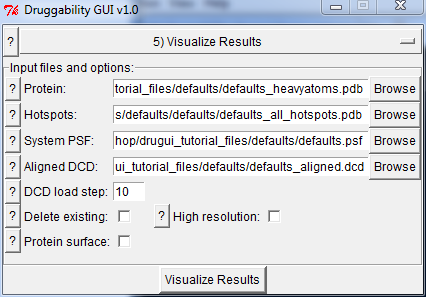

.. _visuals:

Visualization & Analysis
========================

Following interface can be used to generate a quick visualization of
results from druggability analysis.

Input Files
-----------

Input files are :file:`prefix_heavyatoms.pdb` and other PDB files
in :file:`prefix` folder.

Options & Parameters
--------------------

1. If you have outputted aligned trajectory in grid calculation step,
   you can select to load it too.

2. Optionally, molecules present in VMD can be deleted, high
   resolution representations and a protein surface representation
   can be generated.

Probe binding spots
-------------------

When results are loaded, you will see a representation similar to the
following:

.. figure:: _static/hotspots.png
   :scale: 80%

Each sphere corresponds to a probe binding spot. Spheres are colored according
to their binding free energies. Red most sphere has the lowers binding free
energy.

Binding free energies of probes can be found in the logfile:

.. literalinclude:: _static/sample.log

Logfile lists all probe binding spots, their binding free energies,
and fractional contribution of different probe types to the hotspot.

Druggable Sites
---------------

Druggable sites are identified by clustering probe binding spots and
merging them to identify subsets of binding spots that have a size
similar to that of a drug-like molecule.  After results load, you
will see a list of molecules in :guilabel:`VMD Main` for each
druggable site and solutions therein. You can toggle displayed molecules
to see locations of different sites and solutions.

.. figure:: _static/siteone.png
   :scale: 60%

Figure shows the best solution for protein MDM2. The maximal achievable
affinity (druggability index) for this solution is 0.3 nM or, in terms
of free energy, it is -13 kcal/mol.  You can find such information
in the log file shown above.

Probe binding hotspots and protein structure shown above can be found
among tutorial files. These results of course deserve a more detailed analysis,
and some things that can be done include:

  * looking into types of probes that contribute to a given binding spot
    and types of amino acid residue interacting with the binding spot
  * visualizing trajectories (in which probes are wrapped) to see specific
    interactions and residence time of probes at a given binding spot
  * comparing results from simulations in presence and absence of probes to
    see how binding site shape is affected by ligand binding
  * looking into other structures of the target protein (ligand binding sites,
    crystal contacts, protein interfaces) to see whether observations in
    simulations are supported by interactions determined experimentally

Visualize Probe Grids
---------------------

Finally, you can visualize probe occupancy grids using VMD. Simply load :file:`.dx`
files and create :guilabel:`isovolume` representations. An example
is shown below for :file:`sample_IPRO.dx`, and other grid files.
Mesh surfaces correspond to locations that were highly enriched with probes. Coloring
is as follows:

  * isopropanol: green (high enrichment at the binding site)
  * acetate: red (enrichment at the surface, not that proetein has +5 net charge)
  * isopropylamine: blue (few interaction spots)
  * acetamide: magenta (not observed to interact with this protein much)

.. figure:: _static/volume.png
   :scale: 75%

Note that values in occupancy grids is the count of central carbon atoms of probe
molecules. Since the grid elements (voxels) are small (0.5A dimension),
the occupancy numbers are small. You will need to adjust :guilabel:`Isovalue`
value in VMD Representations window to make grid elements visible.

Similar representations can be generated for water or other atom type specific
grids too.

